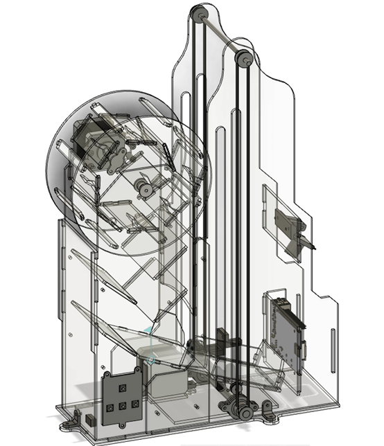

# Описание

Данный проект разработан в рамках московской предпрофессиональной олимпиады командой школы Дмитровский учащихся 9И класса под руководством педагога дополнительного образования Йованович Елены Живомировны. 

**Цель работы:** разработка программно-аппаратного комплекса (ПАК), способного в автоматизированном режиме генерировать псевдослучайные числа.

Генерация чисел происходит путём броска игральных костей. В качестве управляющей платы используется одноплатный компьютер Raspberry Pi 3B.

**Конструкция состоит из:** 

·    подсистемы перемешивания, представляющей собой спираль и башню свободного падения

·    подсистемы сканирования выпавшего числа

·    подсистемы возврата кубиков в подсистему перемешивания

Устройство выполняет все необходимые функции как в бесконечном цикле, так и при запуске подсистем отдельно. Конструкция устойчива и в большей своей степени выполнена из прозрачного оргстекла, что позволяет наблюдать за процессами, происходящими с кубиками. Выпавший результат система успешно распознаёт и отправляет на ПК, не подключенный к управляющей плате генератора псевдослучайных чисел. 

# Состав команды

·    Трубников Никита выполнял 3Д модель спирали, составлял чертежи для всего проекта, собирал все подсистемы в единый прототип

·    Матюшин Иван выполнял 3Д модель башни свободного падения, а также разрабатывал и отлаживал программу

·    Семенов Анатолий разрабатывал механизм подсистемы возврата кубиков в подсистему перемешивания, подбирал электронные компоненты и отвечал за их описание в документации

·    Побудей Иван, разрабатывал 3Д модель крепления камеры, а также подключал все компоненты и создал электрическую и принципиальные схемы

·    Горбовский Александр занимался созданием диаграмм, блок-схем, кинематических схем, оформлением документации. 

Все в равной степени принимали участие в сборке проекта и изготовлении деталей. 

